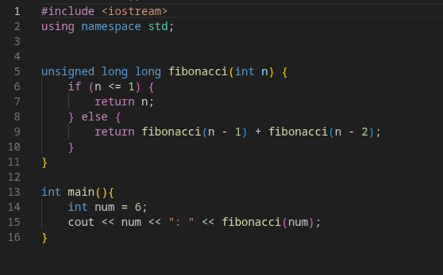
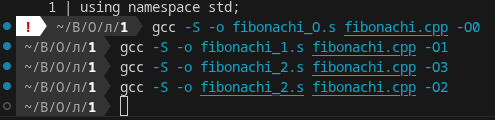
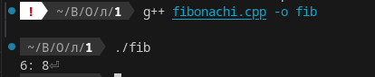
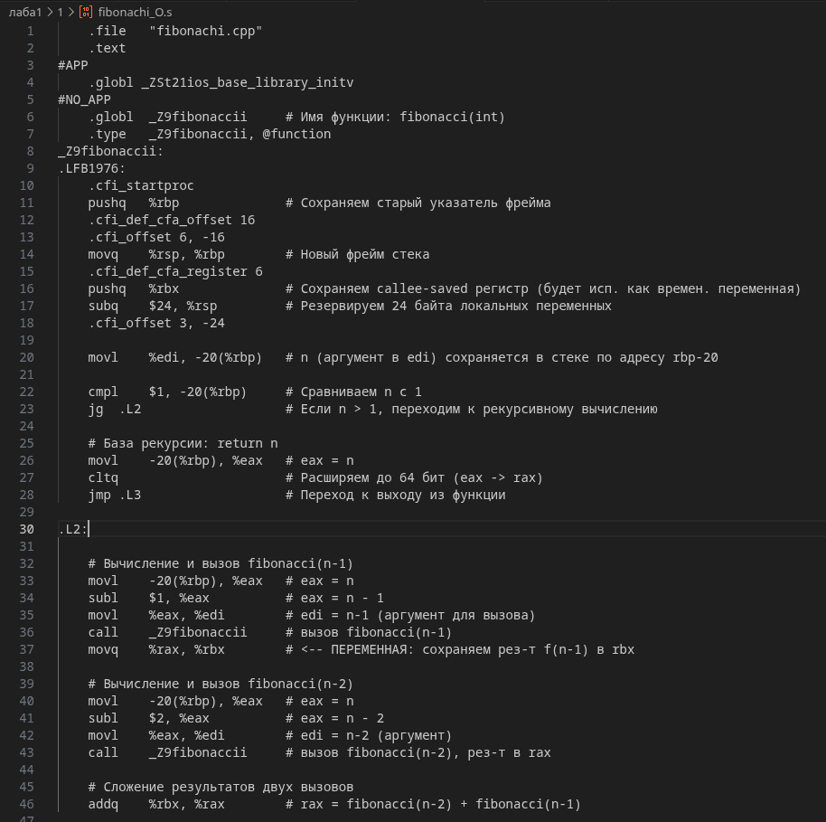
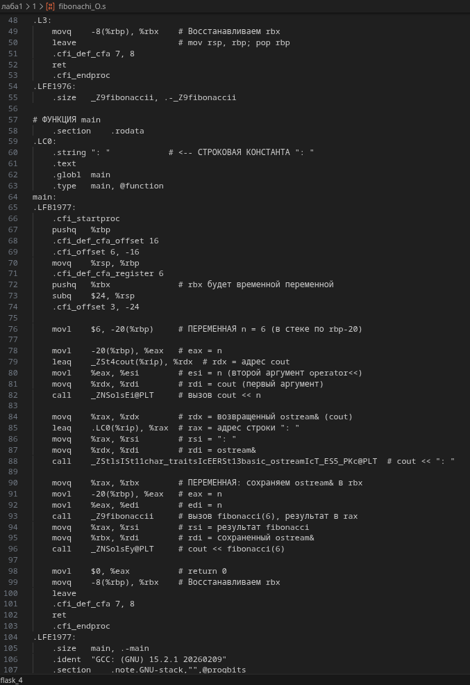
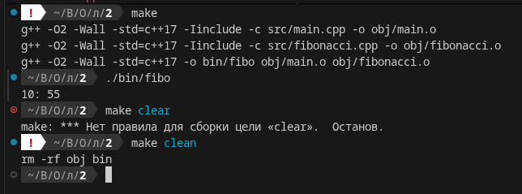
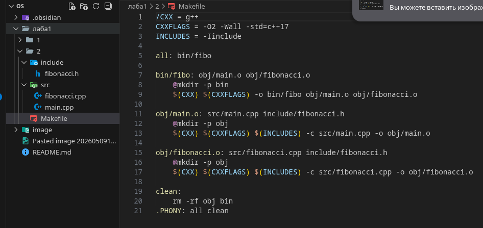
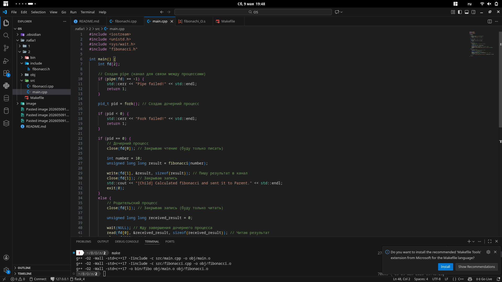
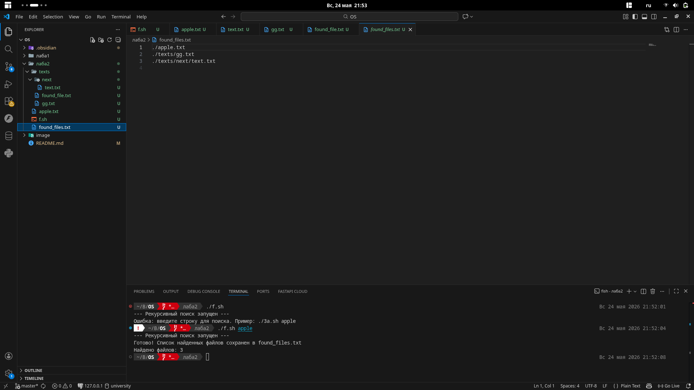

### Лабораторные работы студента Куракова Никиты Андреевича 2261

## Лабораторная 2 - Установка линукса
https://rutube.ru/video/private/c27554c7ee4a7be0d37a113f3615e863/?p=OU3gTJbmrcItpglTtNXkOw

## Лабораторная 1 - Написание программ
Я решил написать вычисление чисел Фибоначчи






### Разбор ассемблер кода




### Makefile 



### Оптимизация до модульной и параллельной
Все исходники в папке лаба1/2


## Лабораторная 3а
Вариант 4

```bash
#!/bin/bash
echo "--- Рекурсивный поиск запущен ---"

SEARCH_STR=$1
OUTPUT_FILE="found_files.txt"

if [ -z "$SEARCH_STR" ]; then
    echo "Ошибка: введите строку для поиска. Пример: ./3a.sh apple"
    exit 1
fi

grep -rl --include="*.txt" "$SEARCH_STR" . > "$OUTPUT_FILE" 2>/dev/null

if [ -s "$OUTPUT_FILE" ]; then
    echo "Готово! Список найденных файлов сохранен в $OUTPUT_FILE"
    echo "Найдено файлов: $(wc -l < "$OUTPUT_FILE")"
else
    echo "Совпадений не найдено ни в текущей папке, ни в подпапках."
    rm "$OUTPUT_FILE"
fi
```
